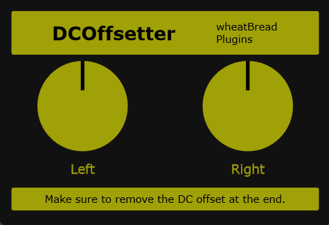

# DCOffsetter - DC Offset Audio Plugin


## Overview

**DCOffsetter** is an audio plugin developed with the JUCE framework. It allows you to adjust the direct current (DC) component of audio signals by adding DC offset (bias) to the audio signal.

It provides independent bias control for left and right stereo channels, supporting various audio processing applications from fine adjustments to significant modifications.

### GUI Preview



## Features

### Core Features

- **Stereo DC Offset Control**: Set independent bias values for the left (L Bias) and right (R Bias) channels
- **Smooth Parameter Changes**: Smooth parameter transitions using SmoothedValue
- **Real-time Processing**: Low-latency audio processing

### Parameters

| Parameter | Range | Default | Description |
|-----------|-------|---------|-------------|
| **L Bias** | -1.0 to 1.0 | 0.0 | Left channel DC offset value |
| **R Bias** | -1.0 to 1.0 | 0.0 | Right channel DC offset value |

## Project Structure

```
DCOffsetter/
├── Source/
│   ├── PluginProcessor.h/cpp       # Audio processor implementation
│   ├── PluginEditor.h/cpp          # Editor UI implementation
│   ├── DSP/
│   │   └── DCOffsetProcessor.h/cpp # DC offset processing engine
│   ├── Parameters/
│   │   └── PluginParameters.h      # Parameter definitions
│   └── LookAndFeel/
│       └── CustomLooks.h/cpp       # Custom UI styling
├── JuceLibraryCode/                # JUCE framework code
├── Builds/
│   └── VisualStudio2026/           # Visual Studio project
├── DCOffsetter.jucer               # JUCE project configuration file
└── README.md                       # This file
```

## Building

### Prerequisites

- **JUCE 8.0** or later
- **Visual Studio 2022** or **2026** (for Windows)

### Building with Visual Studio

1. Open the `DCOffsetter.jucer` file with JUCE Projucer
2. Select the build target (VST3, AAX, Standalone, etc.)
3. Open the solution file in `Builds/VisualStudio2026/` folder
4. Build with Visual Studio

### Configuration with JUCE Projucer

Open `DCOffsetter.jucer` with Projucer to configure:

- Plugin formats (VST3, AAX, AU, LV2, etc.)
- Target platform
- Compiler settings

## Usage

### Basic Operation

1. Insert the plugin in your DAW (Digital Audio Workstation)
2. Set the left channel DC offset using the **L Bias** slider
3. Set the right channel DC offset using the **R Bias** slider

### Typical Use Cases

- **Signal DC Component Adjustment**: Center audio signals as a preprocessing step
- **Waveform Shaping**: Prepare input for non-linear processing
- **Troubleshooting**: Correct recording material containing DC offset artifacts

## Architecture

### Data Flow

```
Input Audio
    ↓
[PluginProcessor::processBlock]
    ↓
[DCOffsetProcessor::process] (L Channel)
[DCOffsetProcessor::process] (R Channel)
    ↓
Output Audio
```

### Key Classes

#### DCOffsetProcessor
- **Role**: Implements DC offset processing
- **Methods**:
  - `prepare()`: Initializes the audio system
  - `setDCOffset()`: Sets the bias value
  - `process()`: Applies bias to audio buffer
  - `reset()`: Resets internal state

#### DCOffsetterAudioProcessor
- **Role**: Implements JUCE AudioProcessor interface
- **Functions**: Parameter management, audio processing flow control

#### DCOffsetterAudioProcessorEditor
- **Role**: User interface implementation
- **Features**: 320x220 pixel custom editor layout

## Parameter Details

### Smooth Transitions with SmoothedValue

Bias values are smoothly changed using `juce::SmoothedValue`, which prevents clicking artifacts when parameters are changed.

```cpp
juce::SmoothedValue<float> dcOffset{0.0f};
```

## License

For details, see the [LICENSE](LICENSE) file.

## Development Information

### Supported Formats

- VST3 (Windows, macOS, Linux)
- AAX (Windows, macOS)
- AU (macOS)
- LV2 (Linux)
- Standalone (executable application)

### Supported Platforms

- **Windows**: 64-bit (recommended)
- **macOS**: 10.11 or later
- **Linux**: ALSA/JACK support

## Troubleshooting

### Build errors occur

1. Verify that the JUCE library is installed correctly
2. Ensure Visual Studio is up to date
3. Delete the `Builds/` folder and regenerate from Projucer

## Related Resources

- [JUCE Official Documentation](https://docs.juce.com/)
- [JUCE Download](https://juce.com/)

---

Last Updated: May 2026
